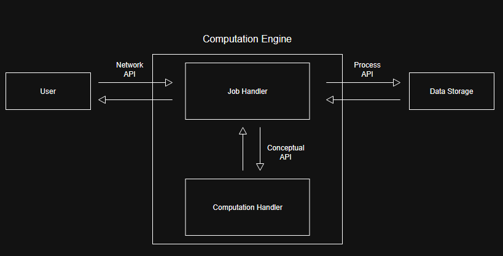

# nth Prime Computation

## Computation

The computation performed by the system will be finding the nth prime
number, where `n` is a positive integer provided as input.

The system will test successive integers to determine whether they are
prime until it has found `n` prime numbers. It will then return the nth
prime number as the output.

### Example

For an input of:

```text
6
```

The output would be:

```text
13
```

This is because the first six prime numbers are:

`2, 3, 5, 7, 11, 13`

Therefore, 13 is the 6th prime number.

## System Diagram

The system consists of a user, a computation engine, and a data storage
system. The computation engine contains a job handler and computation
handler.

